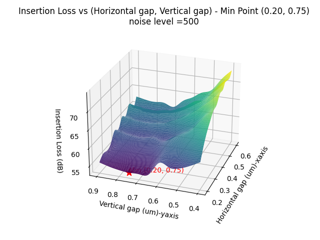

# ANSYS PROJECT: Python API for Modeling Integrated Electro-Optic Modulators in Lumerical

- **Author**: Sunghwan Baek
- **Version**: 3.5
- **Date**: August 10th, 2023
- This is a public version of the Ansys project.
- You need to get an invitation from me to see the private link with the full algorithms I developed.
- The private link: https://github.com/Sunghwan0112/Ansys_Project.git

## 🎯 Project Objective
The primary objective of this project is to construct a structure made of gold, AlGaAs, and GaAs. The project focused on gathering loss data from the GaAs waveguide, varying vertical and horizontal gaps. The ultimate aim is to meticulously identify and establish the optimal vertical and horizontal gap parameters that result in minimal loss. 

## 📌 The Importance of the Project
The project simplifies repetitive tasks based on user requirements. Through a Tkinter interface, users can easily design and monitor block simulations. It integrates Python with Ansys software and utilizes algorithms to optimize the mode. Various libraries are also incorporated to enhance the Ansys user experience. All operations are executed in Python, allowing developers to review the code and tailor the algorithm to their specific requirements.

## 🛠 Configuration

A user-friendly Tkinter interface lets you control almost every variable through the `main.py` file.

### 💡 Main Algorithms:

- **Mode Selector**:
  
   
   - The blue arrow's direction represents the mode referencing direction. The start point of the arrow indicates where the algorithm references the mode from. The data from the previous row or column mode are used to find the current set of modes, and I programmed the algorithm to save the best overlap mode of the last mode to the d-card for the subsequent mode finding.

- **Smart Grid**:
  
   
   - Since I used setting.py variables to control the structures, making a computationally efficient gird area to calculate modes was possible. If the grid area gets bigger, it would be more accurate in terms of loss calculation, but also it gets computationally heavy. Therefore, I could secure accuracy and computational power using the smart grid.

- **Grid Matching**:
  Grid matching algorithm uses block boundaries to assign refractive indices. Also, the algorithm uses an interpolation algorithm to calculate the electric field in the grid area accurately and uses it to calculate the changed refractive indices by the electric field.
  

## 📊 Graph Details
1. 

   
   - Reflects the loss when no electric field is applied.
   - AlGaAs and GaAs refractive indices aren't influenced by the electro-optic effect.

     
2.  

      
  - Reflects the loss when the electric field is applied.
  - Demonstrates the loss with the electro-optic effect in play.
  - Electric fields alter AlGaAs and GaAs refractive indices due to this effect.

    
3. 
  
      
  - Represents Vpil derived from the difference between Original and Bias Losses.

    
4. 
  
      
  - The crucial loss metric we're focusing on (measured in dB).
  - Derived using the Bias Loss and Vpil.

